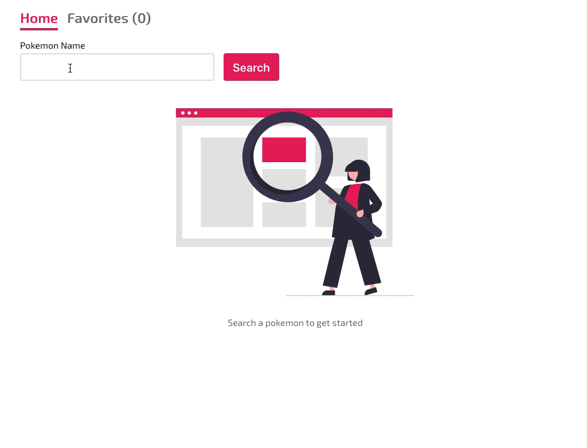

# About this project

This project was bootstrapped with [Create React App](https://github.com/facebook/create-react-app).

## How to run this project?

### 1) Locally

To run the project locally, make sure that you've got Node.js (version 14+) installed. The run `yarn start` to start the project.

### 2) Using Docker

If you've got `docker` (and `docker-compose` installed), you can run the project using the `yarn start:docker` command. This will build a new docker image and run the container with the React app.

## How to run tests?

Use `yarn cypress open` to open the Cypress test runner. Careful, this script doesn't start the app itself, so you'll also need to run `yarn start` (or `yarn start:docker`) alongside.

## Technologies used

-   **React** as the base UI library
-   **Typescript** for type checking
-   **React Router** for client-side routing
-   **Emotion** for CSS-in-JS styling
-   **Cypress** for e2e/integration testing
